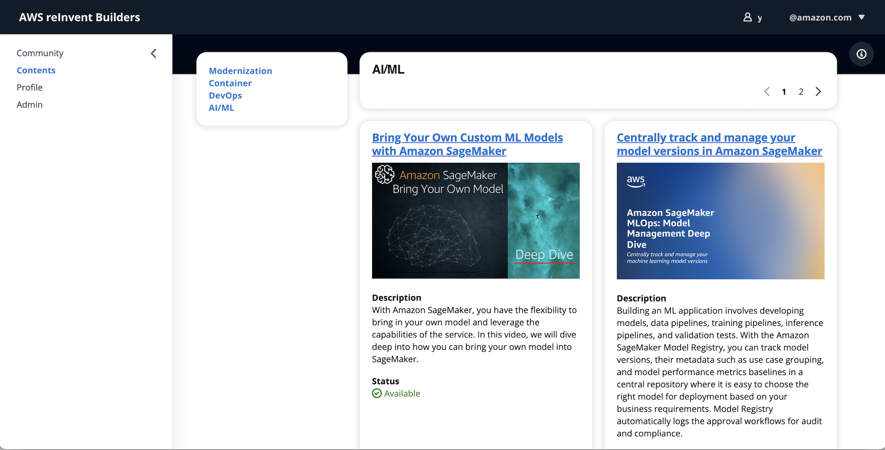
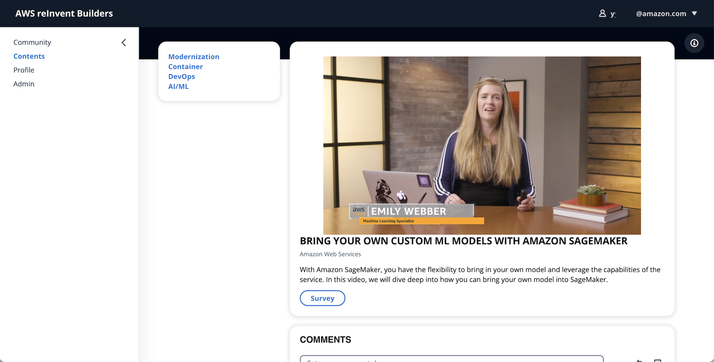
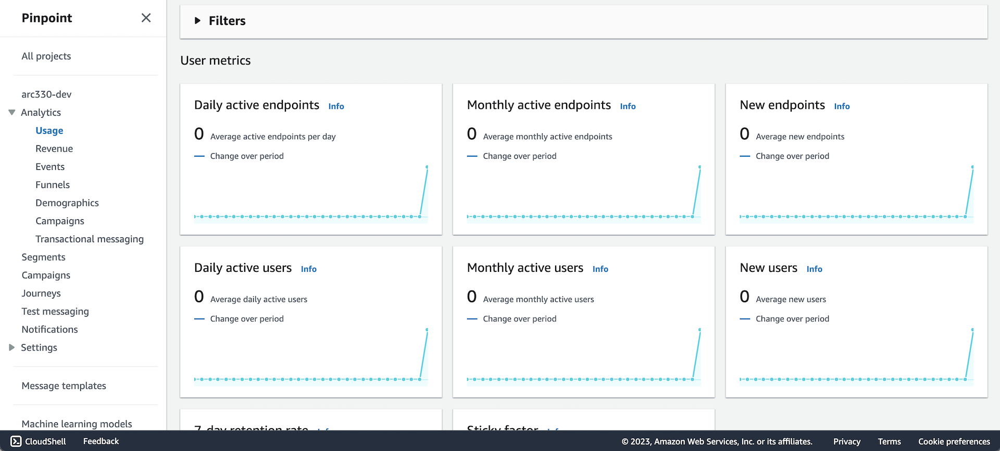
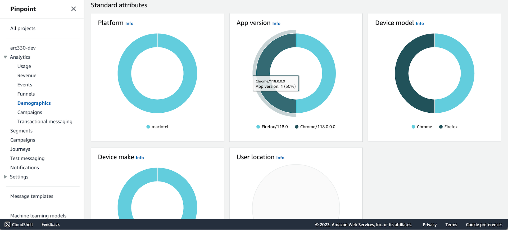

# Build a full-stack application with Cloudscape and AWS Amplify
This is an example shows how to build rapidly a e-learning service with Cloudscape and AWS Amplify and AWS serverless services, such as AWS Cognito, AWS AppSync, Amazon DynamoDB.

**Application**\



**Analytics Dashboard**\




## Getting Started
### Clone repo
Download example as *cloudscape-app* directory:
```
git clone git@github.com:aws-samples/build-full-stack-application-with-cloudscape-and-aws-amplify.git cloudscape-app
```
And change directory to the project source.
```
cd cloudscape-app
```

### Install React packages
Before you run your React application, you have to install *reactstrap* and npm dependencies on your workspace.\
Run npm-install command to download and install the packages:
```
npm install reactstrap
```
You can try to use 'force' option to install the packages, if you see a dependency error message. This will force to install.
```
npm install reactstrap --force
```

### Install Amplify CLI
The Amplify command-iine interface (CLI) is a unified toolchain to create AWS cloud services for your app. To install the amplify-cli on your workspace, vist the [developer guide](https://docs.amplify.aws/cli/start/install/) and follow the instructions.

**macOS**
```
brew install node
npm install -g @aws-amplify/cli
```

### Initialize your Amplify application
You can start to build an application from scratch using amplify-cli `init` command. This task will create a new amplify application on your AWS account.\
Run command:
```
amplify init
```

#### Create Cognito Authn/z
```
amplify add auth
> Cognito User Pool
> Default configuration
> Username
```

### Create AppSync APIs and Databases
```
amplify add api
> Change the auth mode config to Cognito User Pool
> Blank Schema
```

**[Important]** You must replace the auto-generated *graphql.schema* file by amplify-cli in the previous step with pre-defined model schema to run this example porperly.\
Copy the *graphql.scheam* file under the `src/graphql` directory in your project directory, cloned local repository.
```
cp src/graphql/schema.graphql amplify/backend/api/cloudscape-app/graphql.schema
```

Then, update the api configuration using amplify-cli. You can see an update on your local server configuration.
```
amplify update api
```

### Add Analytics platform
```
amplify add analytics
> Amazon Pinpoint
```

### Apply changes
And apply changes on your AWS environment. Thia step will create your backend infrastructure on your AWS account such as Amazon Cognito (Auth), AWS AppSync (API), and Amazon DynamoDB (Database).
```
amplify push
```

### Available Scripts
In the project directory, you can run:

#### `npm start`
Runs the app in the development mode.\
Open [http://localhost:3000](http://localhost:3000) to view it in your browser.
The page will reload when you make changes.\
You may also see any lint errors in the console.

#### `npm test`
Launches the test runner in the interactive watch mode.\
See the section about [running tests](https://facebook.github.io/create-react-app/docs/running-tests) for more information.

#### `npm run build`
Builds the app for production to the `build` folder.\
It correctly bundles React in production mode and optimizes the build for the best performance.
The build is minified and the filenames include the hashes.\
Your app is ready to be deployed!

See the section about [deployment](https://facebook.github.io/create-react-app/docs/deployment) for more information.
